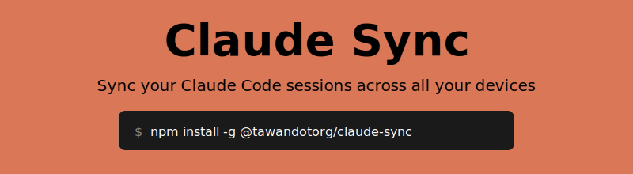

<div align="center">



<br>

*Encrypted with [age](https://github.com/FiloSottile/age) • R2 / S3 / GCS supported*

[](https://github.com/tawanorg/claude-sync/releases)
[](https://go.dev)
[](LICENSE)

[Quick Start](#quick-start) • [Setup Guide](#setup-guide) • [Commands](#commands) • [Security](#security)

</div>

---

## Features

- **Cross-device sync**: Continue Claude Code conversations on any laptop
- **Multi-provider storage**: Cloudflare R2, AWS S3, or Google Cloud Storage
- **End-to-end encryption**: All files encrypted with age before upload
- **Passphrase-based keys**: Same passphrase = same key on any device (no file copying)
- **Interactive wizard**: Arrow-key driven setup with validation
- **Self-updating**: `claude-sync update` to get the latest version
- **Simple CLI**: `push`, `pull`, `status`, `diff`, `conflicts` commands

## Quick Start

### First Device

```bash
# Install
go install github.com/tawanorg/claude-sync/cmd/claude-sync@latest

# Set up (interactive)
claude-sync init

# Push your sessions
claude-sync push
```

### Second Device

```bash
# Install
go install github.com/tawanorg/claude-sync/cmd/claude-sync@latest

# Set up with SAME storage credentials and SAME passphrase
claude-sync init

# Pull sessions
claude-sync pull
```

**That's it!** Same passphrase = same encryption key. No file copying needed.

## Setup Guide

### Step 1: Choose a Storage Provider

| Provider | Free Tier | Best For |
|----------|-----------|----------|
| **Cloudflare R2** | 10GB storage | Personal use (recommended) |
| **AWS S3** | 5GB (12 months) | AWS users |
| **Google Cloud Storage** | 5GB | GCP users |

### Step 2: Create a Bucket

<details>
<summary><b>Cloudflare R2</b> (recommended)</summary>

1. Go to [Cloudflare Dashboard](https://dash.cloudflare.com/) → R2 Object Storage
2. Click "Create bucket" → name it `claude-sync`
3. Go to "Manage R2 API Tokens" → "Create API Token"
4. Select **Object Read & Write** permission → Create

You'll need: Account ID, Access Key ID, Secret Access Key
</details>

<details>
<summary><b>AWS S3</b></summary>

1. Go to [S3 Console](https://s3.console.aws.amazon.com/s3/bucket/create) → Create bucket
2. Go to [IAM Security Credentials](https://console.aws.amazon.com/iam/home#/security_credentials)
3. Create Access Keys

You'll need: Access Key ID, Secret Access Key, Region
</details>

<details>
<summary><b>Google Cloud Storage</b></summary>

1. Go to [Cloud Storage](https://console.cloud.google.com/storage/create-bucket) → Create bucket
2. Go to [Service Accounts](https://console.cloud.google.com/iam-admin/serviceaccounts) → Create service account
3. Grant "Storage Object Admin" role → Create JSON key

You'll need: Project ID, Service Account JSON file (or use `gcloud auth application-default login`)
</details>

### Step 3: Run Init

```bash
claude-sync init
```

The interactive wizard will guide you through:

1. **Select storage provider** (R2, S3, or GCS)
2. **Enter credentials** (provider-specific)
3. **Choose encryption method**:
   - **Passphrase** (recommended) - same passphrase on all devices = same key
   - **Random key** - must copy `~/.claude-sync/age-key.txt` to other devices
4. **Test the connection** to verify everything works

### Step 4: Push and Pull

```bash
# Upload local changes
claude-sync push

# Download remote changes
claude-sync pull
```

## What Gets Synced

| Path | Content |
|------|---------|
| `~/.claude/projects/` | Session files, auto-memory |
| `~/.claude/history.jsonl` | Command history |
| `~/.claude/agents/` | Custom agents |
| `~/.claude/skills/` | Custom skills |
| `~/.claude/plugins/` | Plugins |
| `~/.claude/rules/` | Custom rules |
| `~/.claude/settings.json` | Settings |
| `~/.claude/CLAUDE.md` | Global instructions |

## Commands

```bash
claude-sync init        # Set up configuration (interactive wizard)
claude-sync push        # Upload local changes to cloud storage
claude-sync pull        # Download remote changes from cloud storage
claude-sync status      # Show pending local changes
claude-sync diff        # Show differences between local and remote
claude-sync conflicts   # List and resolve conflicts
claude-sync reset       # Reset configuration (forgot passphrase)
claude-sync update      # Update to latest version
claude-sync --help      # Show all commands
```

### Quiet Mode

```bash
claude-sync push -q     # No output (for scripts)
claude-sync pull -q
```

### Check for Updates

```bash
claude-sync update --check   # Check without installing
claude-sync update           # Download and install latest version
```

## Shell Integration

Add to `~/.zshrc` or `~/.bashrc`:

```bash
# Auto-pull on shell start
if command -v claude-sync &> /dev/null; then
  claude-sync pull -q &
fi

# Auto-push on shell exit
trap 'claude-sync push -q' EXIT
```

## Conflict Resolution

When both local and remote files change, the remote version is saved as `.conflict`:

```bash
claude-sync conflicts            # Interactive resolution
claude-sync conflicts --list     # Just list conflicts
claude-sync conflicts --keep local   # Keep all local versions
claude-sync conflicts --keep remote  # Keep all remote versions
```

Interactive options:
- **[l]** Keep local (delete conflict file)
- **[r]** Keep remote (replace local)
- **[d]** Show diff
- **[s]** Skip
- **[q]** Quit

## Forgot Passphrase?

The passphrase is **never stored**. If you forget it:

1. Your encrypted files cannot be recovered
2. Reset and start fresh:

```bash
claude-sync reset --remote   # Delete remote files and local config
claude-sync init             # Set up again with new passphrase
claude-sync push             # Re-upload from this device
```

## Security

- Files encrypted with [age](https://github.com/FiloSottile/age) before upload
- Passphrase-derived keys use Argon2 (memory-hard KDF)
- Passphrase is never stored - only the derived key at `~/.claude-sync/age-key.txt`
- Cloud storage is private (API key/IAM auth)
- Config files stored with 0600 permissions

## Cost

Claude sessions typically use < 50MB. Syncing is effectively **free** on any provider:

| Provider | Free Tier |
|----------|-----------|
| **Cloudflare R2** | 10GB storage, 1M writes, 10M reads/month |
| **AWS S3** | 5GB for 12 months (then ~$0.023/GB) |
| **Google Cloud Storage** | 5GB, 5K writes, 50K reads/month |

## Installation Options

### From Source (recommended)

```bash
go install github.com/tawanorg/claude-sync/cmd/claude-sync@latest
```

### Build Manually

```bash
git clone https://github.com/tawanorg/claude-sync
cd claude-sync
make build
./bin/claude-sync --version
```

### Download Binary

Download from [GitHub Releases](https://github.com/tawanorg/claude-sync/releases):

```bash
# macOS ARM (M1/M2/M3)
curl -L https://github.com/tawanorg/claude-sync/releases/latest/download/claude-sync-darwin-arm64 -o claude-sync
chmod +x claude-sync
sudo mv claude-sync /usr/local/bin/

# macOS Intel
curl -L https://github.com/tawanorg/claude-sync/releases/latest/download/claude-sync-darwin-amd64 -o claude-sync

# Linux AMD64
curl -L https://github.com/tawanorg/claude-sync/releases/latest/download/claude-sync-linux-amd64 -o claude-sync

# Linux ARM64
curl -L https://github.com/tawanorg/claude-sync/releases/latest/download/claude-sync-linux-arm64 -o claude-sync
```

## Development

```bash
make test          # Run tests
make fmt           # Format code
make check         # Run all pre-commit checks
make build-all     # Build for all platforms
make setup-hooks   # Enable git pre-commit hooks
```

## License

MIT
